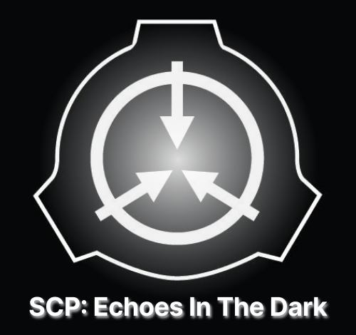
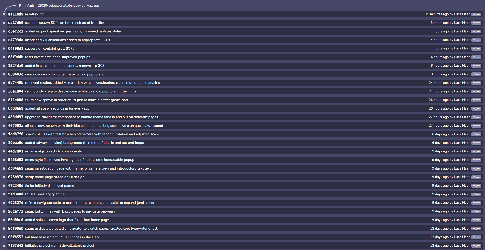

# SCP: Echoes in the Dark

**SCP: Echoes in the Dark** is an augmented reality (AR) app that transforms your space into a spooky SCP field mission. Designed for an elective university class, *Augmented Reality*, this project goes above and beyond expectations, bringing the mysterious SCP universe into the real world.

## Description

This app was inspired by my love for the SCP universe and the challenge of creating something truly unique. Developed as a Halloween-themed project, **SCP: Echoes in the Dark** puts you in the shoes of an SCP field agent, tasked with exploring your surroundings to identify and contain SCP anomalies that manifest in AR.

The project was built using the **8th Wall** AR development platform. Due to workspace access restrictions tied to my university subject, I will no longer be able to make updates or edits once the class concludes. However, this experience allowed me to exceed expectations while creating something truly innovative and spooky.
  
## Demo

Try out the live app: [SCP: Echoes in the Dark on 8th Wall](https://8th.io/9fxpr)  
Watch the demo video: [YouTube Demo](https://www.youtube.com/watch?v=pro7q0HuONc)

## Source Control

The complete source control history for the original development is captured in the image below:  

## Technologies Used

- **8th Wall**: Online AR development platform.
- **Web Technologies**: JavaScript, HTML, and CSS for front-end development.
- **3D Assets**: Models sourced from Sketchfab, combined with SCP specific audio and visual effects for immersion.
- **SFX**: Background theme generated by Suno. Naration generated by ElevenLabs

## Acknowledgments

- **SCP Community**: For inspiring the concept and providing a creative universe to build on.
- **8th Wall**: For the robust platform enabling this AR experience.

---

I thoroughly enjoyed developing this project and pushing myself to go beyond the standard requirements. It was a fun and challenging experience that combined my technical skills with a passion for creative storytelling. I hope you enjoy exploring the SCP world in your own space!
